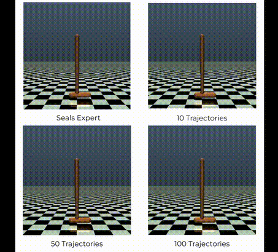
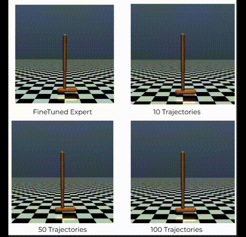
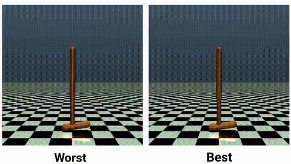
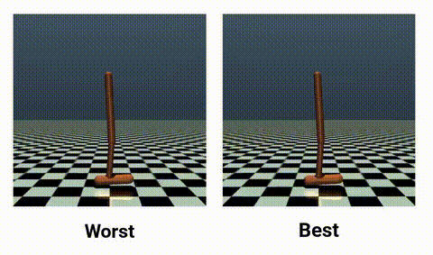
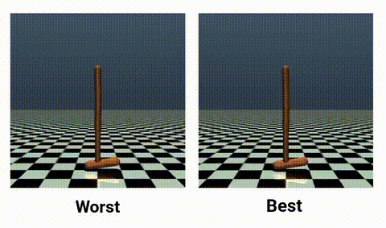

Learners are PPO with the same configuration. 
Reward Nets have the same configuration. 
Differences are the Expert they learn from and number of trajectories. 

Experto 2800 (Seals) + PPO learners con AIRL

Experto 3500 (Finetuned) + PPO learners con AIRL

GPT-4o SAC

GPT-4o PPO

DeepSeek-o1 SAC

DeepSeek-o1 PPO
